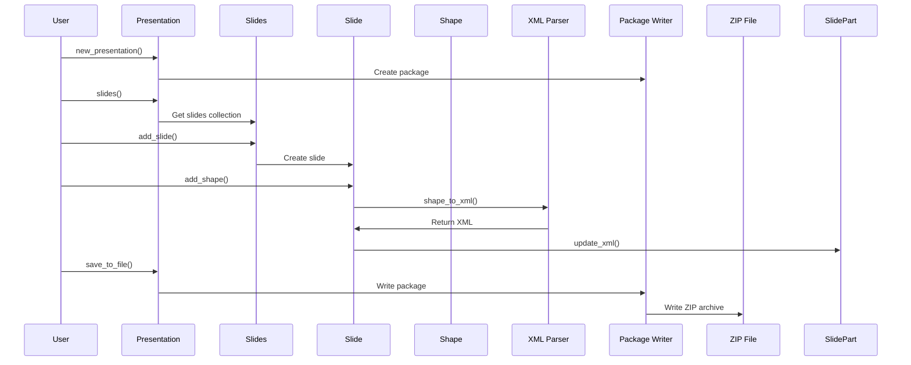

# Architecture

## Overview

ppt-rs is a type-safe, trait-based Rust implementation of PowerPoint file handling, following the OpenXML standard. A .pptx file is a ZIP archive containing XML files and media resources.

**Key Principles**: KISS (Keep It Simple, Stupid), DRY (Don't Repeat Yourself), Trait-based design, Modular structure

**Parity**: 99% with python-pptx (94/95 features)
**Quality**: 667 passing tests, 13 compiler warnings (76% reduction)

## Module Structure

```mermaid
graph TB
    A[ppt_rs] --> B[opc]
    A --> C[oxml]
    A --> D[parts]
    A --> E[shapes]
    A --> F[text]
    A --> G[chart]
    A --> H[dml]
    A --> I[enums]
    A --> J[presentation]
    A --> K[slide]car
    A --> L[table]
    B --> M[Package]
    B --> N[Part]
    B --> O[Relationships]
    C --> P[XML Processing]
    D --> Q[PresentationPart]
    D --> R[SlidePart]
    D --> S[ImagePart]
    D --> T[ChartPart]
    E --> U[BaseShape]
    E --> V[AutoShape]
    E --> W[Picture]
    E --> X[Connector]
    E --> Y[GraphicFrame]
    E --> Z[GroupShape]
    E --> AA[Hyperlink]
    E --> AB[XML Parser]
    G --> AC[Chart]
    G --> AD[ChartTitle]
    G --> AE[ChartSeries]
    G --> AF[ChartLegend]
    G --> AG[Axis]
    H --> AH[ColorFormat]
    H --> AI[FillFormat]
    H --> AJ[LineFormat]
```

## Core Components

### OPC (Open Packaging Convention)
- **Package**: Handles ZIP archive structure
- **Part**: Base trait for all parts in the package
- **Relationships**: Manages relationships between parts
- **PackURI**: Package URI handling
- **PackageReader/Writer**: ZIP archive reading/writing

### OpenXML (oxml)
- XML parsing and generation
- Type-safe XML element handling
- Schema validation

### Parts
- **PresentationPart**: Main presentation document
- **SlidePart**: Individual slides
- **SlideLayoutPart**: Slide layout templates
- **SlideMasterPart**: Slide master templates
- **ImagePart**: Image resources with dimension parsing
- **ChartPart**: Chart data
- **CorePropertiesPart**: Document metadata (Dublin Core)
- **MediaPart**: Video/audio resources

### Shapes
- **BaseShape**: Base shape trait with common properties (position, size, name, ID)
- **AutoShape**: Predefined shapes with **100+ types**:
  - Basic shapes (Rectangle, Oval, Triangle, etc.)
  - Arrows (Arrow, CurvedArrow, etc.)
  - Flowchart shapes (Process, Decision, etc.)
  - Callouts (RectangularCallout, RoundedRectangularCallout, etc.)
  - Action buttons (ActionButtonCustom, ActionButtonHome, etc.)
- **Picture**: Image shapes with crop support
- **Connector**: Connector lines between shapes
- **GraphicFrame**: Container for charts and tables
- **GroupShape**: Grouping of multiple shapes
- **Hyperlink**: Hyperlink support with address and screen_tip
- **XML Parser**: Parse shapes from XML and generate XML for shapes

### Text
- **TextFrame**: Text container with margins
- **Paragraph**: Paragraph handling with alignment and indentation
- **Font**: Font properties (name, size, bold, italic, color)

### Chart
- **Chart**: Chart structure with **100+ chart types**:
  - Area charts (Area, AreaStacked, ThreeDArea, etc.)
  - Bar charts (BarClustered, BarStacked, ThreeDBarClustered, etc.)
  - Column charts (ColumnClustered, ColumnStacked, ThreeDColumn, etc.)
  - Line charts (Line, LineMarkers, ThreeDLine, etc.)
  - Pie charts (Pie, PieExploded, ThreeDPie, etc.)
  - Scatter/Bubble charts (Scatter, Bubble, etc.)
  - Radar charts (Radar, RadarFilled, etc.)
  - Stock charts (StockHLC, StockOHLC, etc.)
  - Surface charts (Surface, SurfaceWireframe, etc.)
  - Cone/Cylinder/Pyramid charts (ConeBarClustered, CylinderCol, etc.)
- **ChartTitle**: Chart title with text formatting
- **ChartSeries**: Data series handling
- **ChartLegend**: Legend positioning and formatting
- **Axis**: CategoryAxis, ValueAxis, DateAxis with scale and formatting

### Table
- **Table**: Table structure with rows and columns
- **TableRow**: Row handling with height
- **TableColumn**: Column handling with width
- **TableCell**: Cell handling with text and formatting

### DML (DrawingML)
- **ColorFormat**: Color handling (RGB, theme colors, brightness)
- **FillFormat**: Fill properties (solid, no fill)
- **LineFormat**: Line properties with **13+ dash styles**:
  - Solid, Dash, DashDot, DashDotDot, Dot
  - RoundDot, SquareDot, LongDash
  - LongDashDot, LongDashDotDot
  - SystemDash, SystemDot, SystemDashDot

### Enums
- **ShapeType**: Shape type enumeration
- **AutoShapeType**: 100+ predefined shape types
- **ChartType**: 100+ chart type variants
- **DashStyle**: 13+ line dash styles
- **TextAlign**: Text alignment options
- **PlaceholderType**: Placeholder shape types
- **ColorType**: Color type enumeration
- **FillType**: Fill type enumeration

### Presentation
- **Presentation**: Main presentation class
  - Create new presentations
  - Open existing presentations
  - Save presentations to file
  - Manage slide dimensions
  - Access slides collection

### Slide
- **Slide**: Slide class
  - Parse shapes from XML
  - Add shapes to slide
  - Manage slide name
  - Access slide part
- **Slides**: Slides collection
  - Add slides
  - Get slides by index
  - Manage slide count
- **SlideMasters**: Slide masters collection
- **SlideLayouts**: Slide layouts collection

## Data Flow



## Key Design Decisions

1. **Trait-based Architecture**: Using traits for flexibility and testability
   - `Part`: Base trait for all package parts
   - `Shape`: Base trait for all shapes
   - `Dimensioned`: Objects with width/height
   - `PropertyAccessor<T>`: Unified property access pattern
   - `Collection<T>`: Common collection interface
   - `Metadata`: Objects with metadata
   - `Saveable`: Objects that can be saved
   - `Openable`: Objects that can be opened

2. **Modular Structure**: Clear separation of concerns
   - `presentation/traits.rs`: Common traits
   - `presentation/properties.rs`: PropertiesManager for unified property access
   - Each feature in dedicated module (animations, RTL, OLE, 3D, media, etc.)

3. **Ownership Model**: Clear ownership semantics with `Box<dyn Shape>` for dynamic dispatch

4. **Error Handling**: Using `Result<T, PptError>` for error propagation

5. **XML Parsing**: Regex-based parsing for simplicity (can be enhanced with proper XML parser)

6. **EMU Units**: All measurements in EMU (English Metric Units) for precision

7. **Type Safety**: Strong typing with enums for chart types, shape types, etc.

8. **KISS Principle**: Keep code simple and maintainable
   - Avoid over-engineering
   - Use sensible defaults
   - Clear naming conventions

9. **DRY Principle**: Don't Repeat Yourself
   - Reuse traits across modules
   - Centralize common functionality
   - PropertiesManager for property management

## Test Coverage

**667 tests passing (100%)** covering:
- OPC components (PackURI, Relationships, Package)
- Parts (PresentationPart, SlidePart, ImagePart, ChartPart, CorePropertiesPart)
- Shapes (BaseShape, AutoShape, Picture, Connector, GraphicFrame, GroupShape)
- Shape XML operations (parsing, generation, ID management)
- Hyperlinks (creation, XML generation/parsing, escape/unescape)
- Text (TextFrame, Paragraph, Font)
- Tables (Table, TableRow, TableColumn, TableCell)
- Charts (Chart, ChartTitle, ChartSeries, ChartLegend, Axes)
- DML (ColorFormat, FillFormat, LineFormat with all dash styles)
- Enums (ChartType, AutoShapeType equality and operations)
- Slides (basic operations, masters, layouts)
- Presentation (save, open, slide dimensions)

## Future Enhancements

- Full XML parser (replace regex-based parsing)
- Table styles
- Text hyperlinks
- Gradient/pattern/picture fills
- Slide backgrounds and transitions
- Placeholder shapes
- Advanced chart features (data management, Excel integration)
- Freeform shapes
- Shadow effects
- OLE objects
