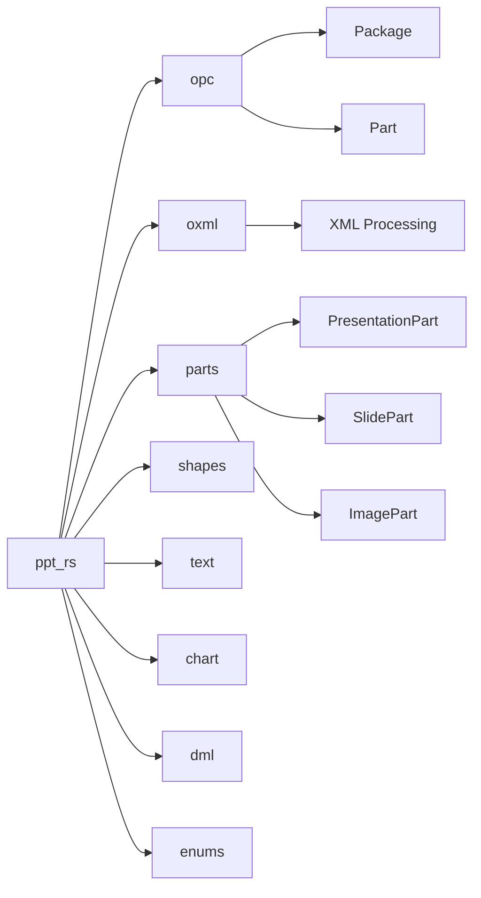

# Architecture

## Overview

ppt-rs is structured following the OpenXML standard for PowerPoint files. A .pptx file is essentially a ZIP archive containing XML files and media resources.

## Module Structure

## Core Components

### OPC (Open Packaging Convention)
- Handles ZIP archive structure
- Manages parts and relationships
- Serialization/deserialization

### OpenXML (oxml)
- XML parsing and generation
- Type-safe XML element handling
- Schema validation

### Parts
- PresentationPart: Main presentation document
- SlidePart: Individual slides
- ImagePart: Image resources
- ChartPart: Chart data
- MediaPart: Video/audio resources

### Shapes
- Base shape functionality
- AutoShapes, Pictures, Connectors
- Group shapes

### Text
- Text formatting
- Paragraph and run handling
- Font management

### Chart
- Chart creation and modification
- Data series handling
- Chart formatting

### DML (DrawingML)
- Colors, fills, lines
- Effects and formatting

