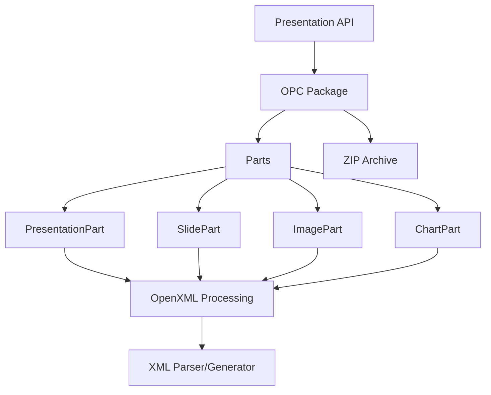

# ppt-rs

[](https://crates.io/crates/ppt-rs)
[](https://docs.rs/ppt-rs)
[](LICENSE)

A Rust library for creating, reading, and updating PowerPoint (.pptx) files.

This is a Rust port of the [python-pptx](https://github.com/scanny/python-pptx) library, providing a safe and efficient way to work with PowerPoint files in Rust.

## Features

- ✅ Create new PowerPoint presentations
- ✅ Read existing .pptx files
- ✅ Modify slides, shapes, text, images, and charts
- ✅ Full support for OpenXML format (ISO/IEC 29500)
- ✅ Comprehensive shape support (AutoShape, Picture, Connector, GraphicFrame, GroupShape)
- ✅ Chart support with axes (CategoryAxis, ValueAxis, DateAxis)
- ✅ Table support with formatting options
- ✅ DrawingML support (colors, fills, lines)

## Installation

Add this to your `Cargo.toml`:

```toml
[dependencies]
ppt-rs = "0.1.0"
```

## Quick Start

```rust
use ppt_rs::new_presentation;

// Create a new presentation
let mut prs = new_presentation()?;

// Get slides collection
let slides = prs.slides();

// Add a slide (when implemented)
// let slide = slides.add_slide(...)?;

// Save the presentation
prs.save_to_file("output.pptx")?;
```

## Architecture



## Status

🚧 **Work in Progress** - This library is currently under active development.

**Current Status:**
- ✅ Core OPC (Open Packaging Convention) support
- ✅ Parts module (all major parts implemented)
- ✅ Shapes module (AutoShape, Picture, Connector, GraphicFrame, GroupShape)
- ✅ Text module (TextFrame, Paragraph, Font)
- ✅ Table module
- ✅ Chart module (with axes support)
- ✅ DML (DrawingML) module
- ⚠️ XML serialization (in progress)
- ⚠️ Advanced features (placeholders, hyperlinks, effects)

**Test Coverage:** 69 tests passing

## Documentation

- [API Documentation](https://docs.rs/ppt-rs)
- [Migration Status](MIGRATION_STATUS.md)
- [Architecture](ARCHITECTURE.md)

## Examples

### Creating a Presentation

```rust
use ppt_rs::new_presentation;

let mut prs = new_presentation()?;
// ... add slides, shapes, etc.
prs.save_to_file("presentation.pptx")?;
```

### Working with Shapes

```rust
use ppt_rs::shapes::{AutoShape, AutoShapeType};

let mut shape = AutoShape::new(1, "Rectangle".to_string(), AutoShapeType::Rectangle);
shape.set_width(914400); // 1 inch in EMU
shape.set_height(914400);
```

### Working with Charts

```rust
use ppt_rs::chart::{Chart, ChartType, CategoryAxis, ValueAxis};

let mut chart = Chart::new(ChartType::ColumnClustered);
chart.set_has_title(true);
chart.title_mut().unwrap().set_text("Sales Data");

let cat_axis = chart.category_axis_mut();
cat_axis.set_has_title(true);

let val_axis = chart.value_axis_mut();
val_axis.set_minimum_scale(Some(0.0));
val_axis.set_maximum_scale(Some(100.0));
```

## Requirements

- Rust 1.70 or later
- Rust edition 2024

## License

Licensed under the Apache License, Version 2.0 ([LICENSE](LICENSE) or http://www.apache.org/licenses/LICENSE-2.0)

## Contributing

Contributions are welcome! Please feel free to submit a Pull Request.

## Acknowledgments

This library is a port of [python-pptx](https://github.com/scanny/python-pptx) by Steve Canny. Many thanks for the excellent reference implementation.

