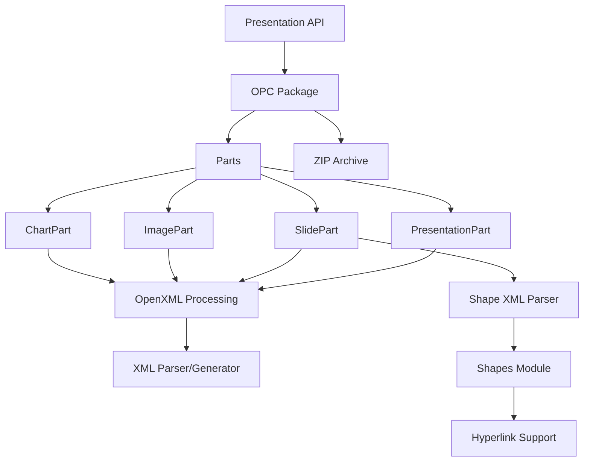

# ppt-rs

[](https://crates.io/crates/ppt-rs)
[](https://docs.rs/ppt-rs)
[](LICENSE)

A Rust library for creating, reading, and updating PowerPoint (.pptx) files.

This is a Rust port of the [python-pptx](https://github.com/scanny/python-pptx) library, providing a safe and efficient way to work with PowerPoint files in Rust.

## Features

- ✅ Create new PowerPoint presentations
- ✅ Read existing .pptx files
- ✅ Modify slides, shapes, text, images, and charts
- ✅ Full support for OpenXML format (ISO/IEC 29500)
- ✅ Comprehensive shape support (AutoShape, Picture, Connector, GraphicFrame, GroupShape)
- ✅ **100+ AutoShape types** (rectangles, arrows, flowchart shapes, callouts, action buttons, etc.)
- ✅ Chart support with axes (CategoryAxis, ValueAxis, DateAxis)
- ✅ **100+ Chart types** (Area, Bar, Column, Line, Pie, Scatter, Bubble, Radar, Stock, Surface, Cone, Cylinder, Pyramid, 3D variants)
- ✅ Table support with formatting options
- ✅ DrawingML support (colors, fills, lines)
- ✅ **Hyperlink support** for shapes and text
- ✅ **Shape XML parsing and generation** for reading/writing shapes
- ✅ **13+ Line dash styles** (Solid, Dash, Dot, LongDash, SystemDash, etc.)

## Installation

Add this to your `Cargo.toml`:

```toml
[dependencies]
ppt-rs = "0.1.0"
```

## Quick Start

```rust
use ppt_rs::new_presentation;

// Create a new presentation
let mut prs = new_presentation()?;

// Get slides collection
let mut slides = prs.slides();

// Add a slide
let layout_part = ppt_rs::parts::slide::SlideLayoutPart::new(
    ppt_rs::opc::packuri::PackURI::new("/ppt/slideLayouts/slideLayout1.xml")?
)?;
let slide = slides.add_slide(&layout_part)?;

// Add a shape with hyperlink
use ppt_rs::shapes::{AutoShape, AutoShapeType, Hyperlink};
let mut shape = AutoShape::new(1, "Link".to_string(), AutoShapeType::Rectangle);
let hlink = Hyperlink::with_address("https://example.com".to_string());
shape.set_hyperlink(Some(hlink));
slide.add_shape(Box::new(shape))?;

// Save the presentation
prs.save_to_file("output.pptx")?;
```

## Architecture



## Status

🚧 **Work in Progress** - This library is currently under active development.

**Current Status:**
- ✅ Core OPC (Open Packaging Convention) support
- ✅ Parts module (all major parts implemented)
- ✅ Shapes module (AutoShape, Picture, Connector, GraphicFrame, GroupShape)
- ✅ **100+ AutoShape types** (basic shapes, arrows, flowchart shapes, callouts, action buttons)
- ✅ **Hyperlink support** for shapes (AutoShape, Picture)
- ✅ **Shape XML parsing and generation**
- ✅ Text module (TextFrame, Paragraph, Font)
- ✅ Table module
- ✅ Chart module (with axes support)
- ✅ **100+ Chart types** (Area, Bar, Column, Line, Pie, Scatter, Bubble, Radar, Stock, Surface, Cone, Cylinder, Pyramid, 3D variants)
- ✅ DML (DrawingML) module
- ✅ **13+ Line dash styles**
- ⚠️ XML serialization (in progress)
- ⚠️ Advanced features (placeholders, effects)

**Test Coverage:** **208 tests passing** ✅

## Documentation

- [API Documentation](https://docs.rs/ppt-rs)
- [Examples and Test Cases](EXAMPLES.md)
- [Migration Status](MIGRATION_STATUS.md)
- [Architecture](ARCHITECTURE.md)
- [TODO](TODO.md)

## Examples

### Creating a Presentation

```rust
use ppt_rs::new_presentation;

let mut prs = new_presentation()?;
// ... add slides, shapes, etc.
prs.save_to_file("presentation.pptx")?;
```

### Working with Shapes

```rust
use ppt_rs::shapes::{AutoShape, AutoShapeType};

let mut shape = AutoShape::new(1, "Rectangle".to_string(), AutoShapeType::Rectangle);
shape.set_width(914400); // 1 inch in EMU
shape.set_height(914400);
```

### Working with Hyperlinks

```rust
use ppt_rs::shapes::{AutoShape, AutoShapeType, Hyperlink};

let mut shape = AutoShape::new(1, "Link".to_string(), AutoShapeType::Rectangle);
let mut hlink = Hyperlink::with_address("https://example.com".to_string());
hlink.set_screen_tip(Some("Example Site".to_string()));
shape.set_hyperlink(Some(hlink));
```

### Working with Charts

```rust
use ppt_rs::chart::{Chart, ChartType};
use ppt_rs::chart::axis::{CategoryAxis, ValueAxis};

let mut chart = Chart::new(ChartType::ColumnClustered);
chart.set_has_title(true);
chart.title_mut().unwrap().set_text("Sales Data");

let cat_axis = chart.category_axis_mut();
cat_axis.set_has_title(true);

let val_axis = chart.value_axis_mut();
val_axis.set_minimum_scale(Some(0.0));
val_axis.set_maximum_scale(Some(100.0));
```

### Parsing Shapes from XML

```rust
use ppt_rs::shapes::xml::parse_shapes_from_xml;

let xml = r#"<p:spTree>
    <p:sp>
        <p:nvSpPr>
            <p:cNvPr id="2" name="Rectangle 1"/>
        </p:nvSpPr>
        <p:spPr>
            <a:xfrm>
                <a:off x="1000000" y="2000000"/>
                <a:ext cx="3000000" cy="4000000"/>
            </a:xfrm>
        </p:spPr>
    </p:sp>
</p:spTree>"#;

let shapes = parse_shapes_from_xml(xml)?;
```

## Requirements

- Rust 1.70 or later
- Rust edition 2024

## License

Licensed under the Apache License, Version 2.0 ([LICENSE](LICENSE) or http://www.apache.org/licenses/LICENSE-2.0)

## Contributing

Contributions are welcome! Please feel free to submit a Pull Request.

## Acknowledgments

This library is a port of [python-pptx](https://github.com/scanny/python-pptx) by Steve Canny. Many thanks for the excellent reference implementation.

